<!-- SLIDE TITLE CONVENTION: every slide title is a short sentence stating the
     point of the slide (the takeaway), not a topic label. Apply this to all
     current and future slides. -->

## Bulk RNA collapses a cell mixture into one expression vector

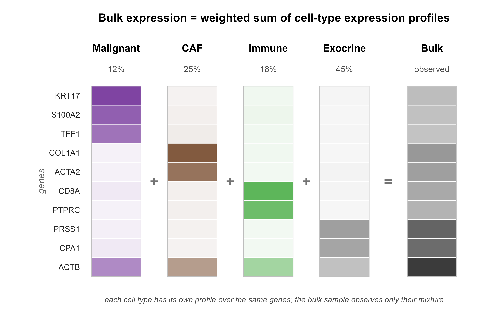{width="90%"}

::: {.notes}
PDAC is lethal; bulk RNA is what most cohorts have. We subtype tumors to predict outcome. The catch is that one bulk vector is a weighted average over many cell types — so the prognostic signal is entangled with composition.
:::

## NMF factors the mixture into interpretable gene programs

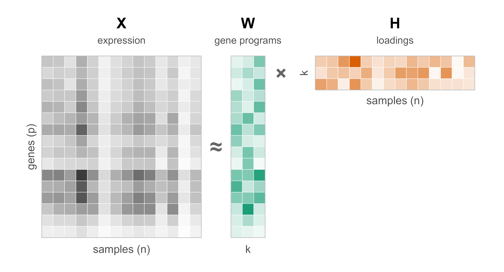{width="92%"}

::: {.notes}
NMF is how the field derived Basal/Classical and CAF signatures (Moffitt virtual microdissection). W (green) = gene programs, H (orange) = per-sample loadings — keep these colors in mind, they recur on every method slide.
:::

## Reconstruction ≠ prognosis

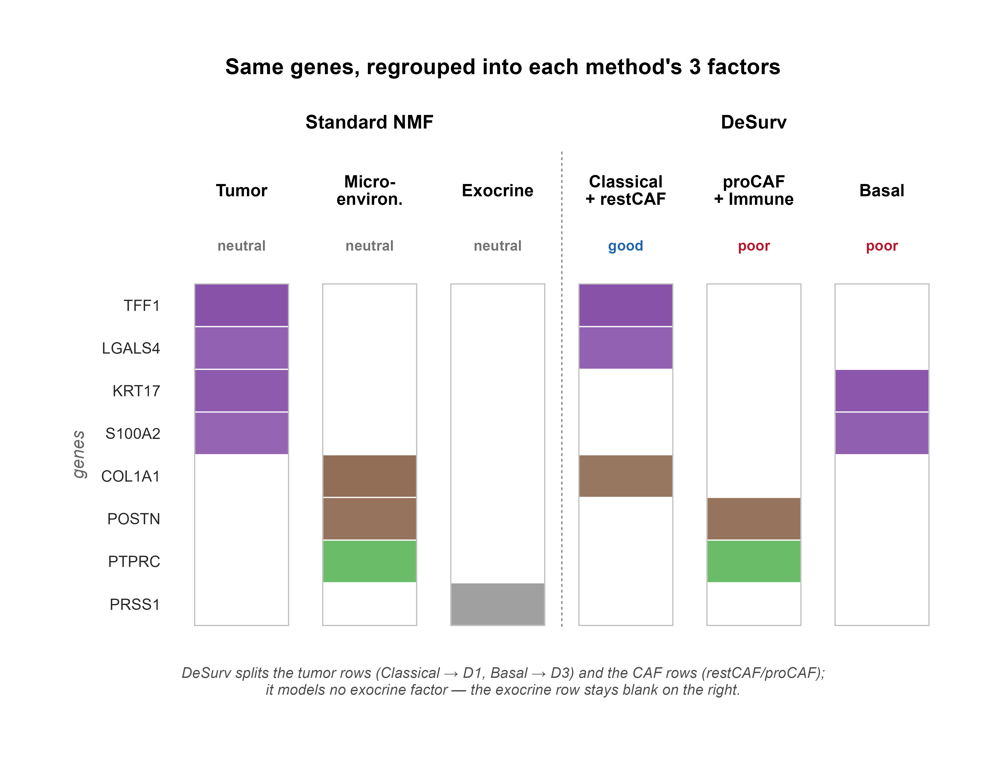{width="96%"}

::: {.notes}
Spine of the whole talk. Three factorizations all reconstruct X equally well (R² ≈ 0.95) yet separate survival differently. Reconstruction expresses no preference among them — so picking one unsupervised is a coin flip on prognosis. DeSurv's blended objective *tilts toward* the prognostic solution — it biases, it does not uniquely pin.
:::

## DeSurv couples NMF reconstruction with a Cox survival objective

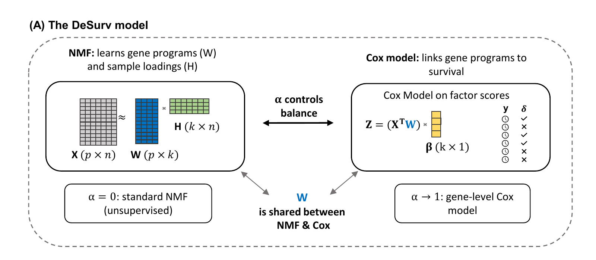{width="92%"}

::: {.notes}
DeSurv fits one shared W. The left half is ordinary NMF (X ≈ WH); the right half is a Cox model on factor scores Z = XᵀW. A single weight α balances the two: α=0 is standard unsupervised NMF, α→1 is a gene-level Cox model. W is the object both losses share — that's what makes the programs prognostic *and* reconstructive.
:::

## The survival gradient updates the programs (W), not the loadings (H)

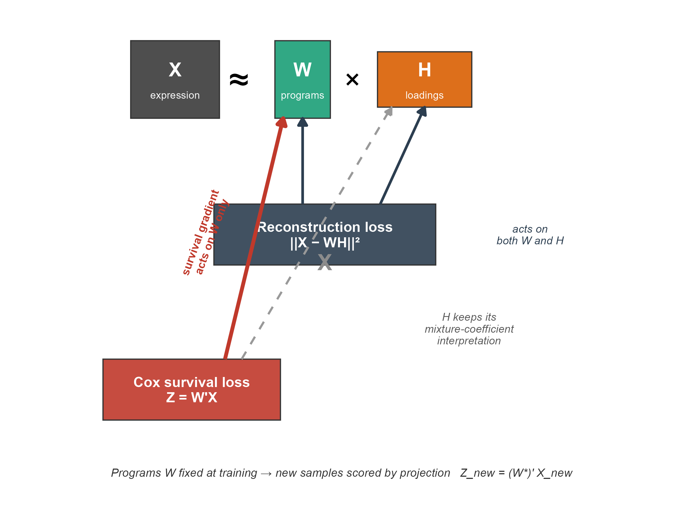{width="80%"}

::: {.notes}
This is the key architectural choice. Reconstruction updates both W and H; the Cox survival gradient touches W only. H stays a clean mixture coefficient, so new samples are scored by simple projection Z = W̃ᵀX_new — no retraining, no per-sample refitting at validation. Methods that supervise through H can't be transported this way.
:::

## Bayesian optimization tunes the model by cross-validated C-index

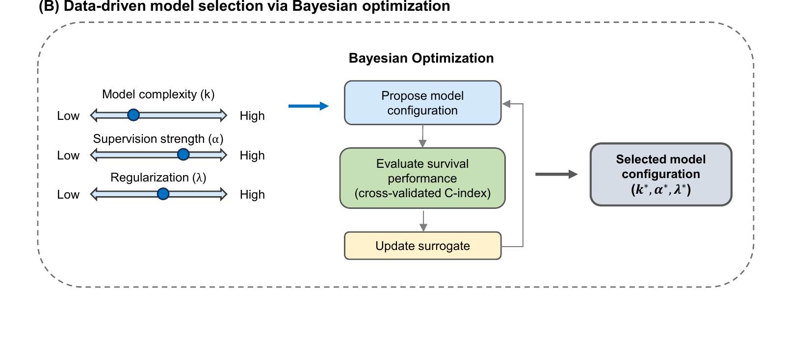{width="90%"}

::: {.notes}
Rank k, supervision strength α, and regularization λ aren't set by hand. Bayesian optimization proposes a configuration, scores it by nested cross-validated C-index, updates a surrogate, and iterates — returning (k*, α*, λ*). Final k by the 1-SE rule. No validation survival enters the fit. Crucially, when survival carries no signal, BO drives α→0 and DeSurv collapses back to NMF.
:::

## Survival supervision should recover prognostic programs more reliably

Two tests:

1. **Ground-truth recovery** in simulation
2. **Out-of-sample generalization** to 5 cohorts

::: {.notes}
The claim is falsifiable two ways. Simulation gives a known answer to recover. External validation is scored purely by projection — no retraining, no validation survival used in fitting. Neither test can be gamed by the training objective.
:::

## Simulation gives a known prognostic program to recover

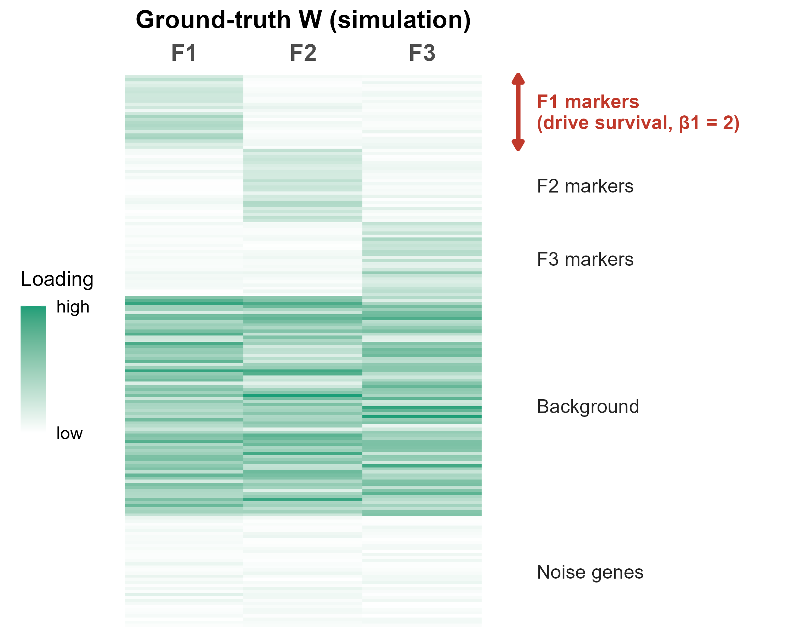{width="70%"}

::: {.notes}
First test: a nonnegative factor model with known truth. Three factors (k=3), each with its own marker genes, a shared background block, and noise genes — 3,000 genes, n=200. Only F1's markers drive survival (β=2,0,0), and that program explains *low* variance. So we know exactly which genes the method should recover, and the prognostic signal is deliberately hard to find by variance alone.
:::

## DeSurv recovers the true prognostic program and rank

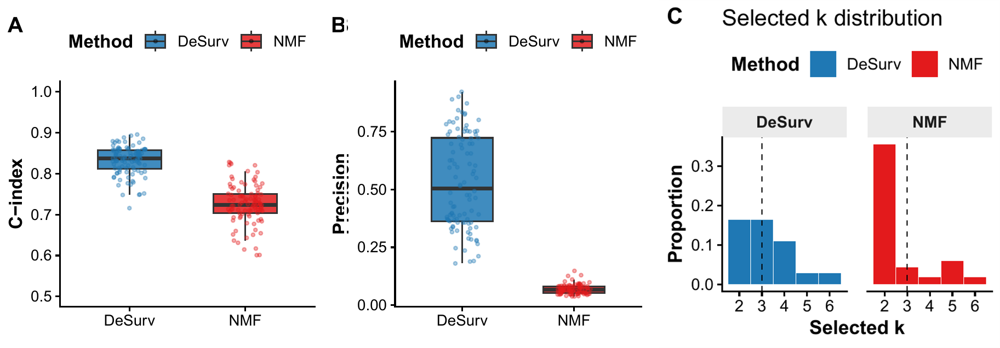{width="98%"}

::: {.notes}
DeSurv beats NMF on test C-index (A), but the decisive panel is B: NMF's precision is near zero — it predicts survival reasonably while recovering almost none of the true marker genes. Its rotation freedom spans a similar predictive subspace but scrambles *which* genes; supervision pins the basis. C: DeSurv recovers the true rank k=3; NMF favors k=2. Precision gap ≫ C-index gap is the headline.
:::

## DeSurv concentrates survival signal into one factor

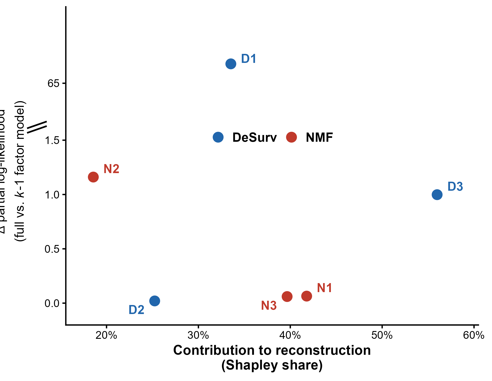{width="55%"}

::: {.notes}
This is the slide-4 thesis made empirical in PDAC. x-axis: each factor's share of reconstruction (normalized Shapley value, partitions and sums to 100%); y-axis: its survival contribution (drop in partial log-likelihood when removed). DeSurv's D1 sits top-left — it carries essentially all the survival signal (Δℓ ≈ 66) at only a modest reconstruction share. The factors that reconstruct PDAC best — DeSurv's D3 and NMF's N1/N3 at the right — contribute almost nothing to survival. Reconstruction and prognosis are decoupled, so an unsupervised, reconstruction-driven choice walks right past the prognostic factor.
:::

## Supervision reorganizes PDAC factors around prognosis

:::: {.columns}

::: {.column width="50%"}
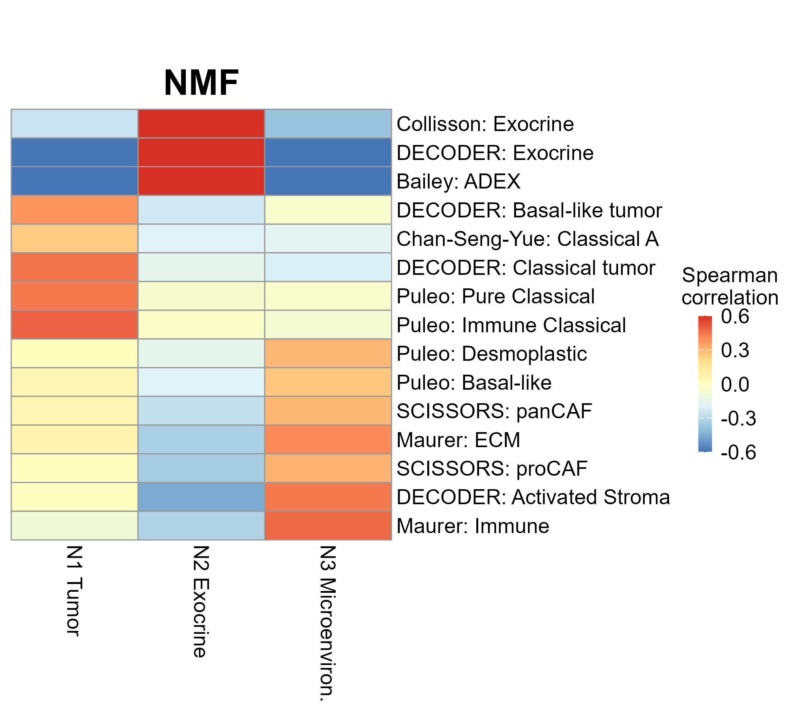
:::

::: {.column width="50%"}
::: {.fragment}
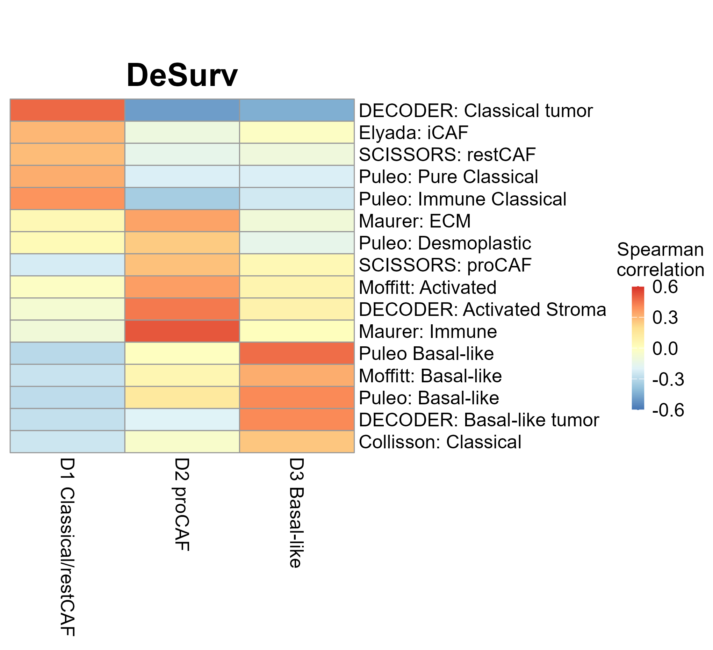
:::
:::

::::

::: {.notes}
Same data, same rank k=3, different factors. DeSurv's D1 fuses Classical tumor *and* restCAF stroma into one prognostic axis — a tumor–stroma coupling, not a pure tumor signal. Unsupervised NMF instead burns a whole factor (N2) on exocrine/ADEX — normal-pancreas contamination and purity — and splits the rest across N1/N3. Supervision rebuilds what each factor captures; D1 has no clean NMF counterpart.
:::
