## Bulk RNA collapses a cell mixture into one expression vector

<!-- SLIDE TITLE CONVENTION: every slide title is a short sentence stating the
     point of the slide (the takeaway), not a topic label. Apply this to all
     current and future slides. Note: keep this comment inside a slide (after a
     heading); placed before the first heading it renders as a blank slide. -->

{width="90%"}

::: {.notes}
PDAC is lethal; bulk RNA is what most cohorts have. We subtype tumors to predict outcome. The catch is that one bulk vector is a weighted average over many cell types — so the prognostic signal is entangled with composition.
:::

## NMF factors the mixture into interpretable gene programs

{width="92%"}

::: {.notes}
NMF is how the field derived Basal/Classical and CAF signatures (Moffitt virtual microdissection). W (green) = gene programs, H (orange) = per-sample loadings — keep these colors in mind, they recur on every method slide.
:::

## Reconstruction ≠ prognosis

{width="96%"}

::: {.notes}
Spine of the whole talk. Three factorizations all reconstruct X equally well (R² ≈ 0.95) yet separate survival differently. Reconstruction expresses no preference among them — so picking one unsupervised is a coin flip on prognosis. DeSurv's blended objective *tilts toward* the prognostic solution — it biases, it does not uniquely pin.
:::

## DeSurv couples NMF reconstruction with a Cox survival objective

{width="92%"}

::: {.notes}
DeSurv fits one shared W. The left half is ordinary NMF (X ≈ WH); the right half is a Cox model on factor scores Z = XᵀW. A single weight α balances the two: α=0 is standard unsupervised NMF, α→1 is a gene-level Cox model. W is the object both losses share — that's what makes the programs prognostic *and* reconstructive.
:::

## The survival gradient updates the programs (W), not the loadings (H)

{width="80%"}

::: {.notes}
This is the key architectural choice. Reconstruction updates both W and H; the Cox survival gradient touches W only. H stays a clean mixture coefficient, so new samples are scored by simple projection Z = W̃ᵀX_new — no retraining, no per-sample refitting at validation. Methods that supervise through H can't be transported this way.
:::

## Bayesian optimization tunes the model by cross-validated C-index

{width="90%"}

::: {.notes}
Rank k, supervision strength α, and regularization λ aren't set by hand. Bayesian optimization proposes a configuration, scores it by nested cross-validated C-index, updates a surrogate, and iterates — returning (k*, α*, λ*). Final k by the 1-SE rule. No validation survival enters the fit. Crucially, when survival carries no signal, BO drives α→0 and DeSurv collapses back to NMF.
:::

## Survival supervision should recover prognostic programs more reliably

Two tests:

1. **Ground-truth recovery** in simulation
2. **Out-of-sample generalization** to 5 cohorts

::: {.notes}
The claim is falsifiable two ways. Simulation gives a known answer to recover. External validation is scored purely by projection — no retraining, no validation survival used in fitting. Neither test can be gamed by the training objective.
:::

## Simulation gives a known prognostic program to recover

{width="70%"}

::: {.notes}
First test: a nonnegative factor model with known truth. Three factors (k=3), each with its own marker genes, a shared background block, and noise genes — 3,000 genes, n=200. Only F1's markers drive survival (β=2,0,0), and that program explains *low* variance. So we know exactly which genes the method should recover, and the prognostic signal is deliberately hard to find by variance alone.
:::

## DeSurv recovers the true prognostic program and rank

{width="98%"}

::: {.notes}
DeSurv beats NMF on test C-index (A), but the decisive panel is B: NMF's precision is near zero — it predicts survival reasonably while recovering almost none of the true marker genes. Its rotation freedom spans a similar predictive subspace but scrambles *which* genes; supervision pins the basis. C: DeSurv recovers the true rank k=3; NMF favors k=2. Precision gap ≫ C-index gap is the headline.
:::

## Training and validation cohorts are held fully apart

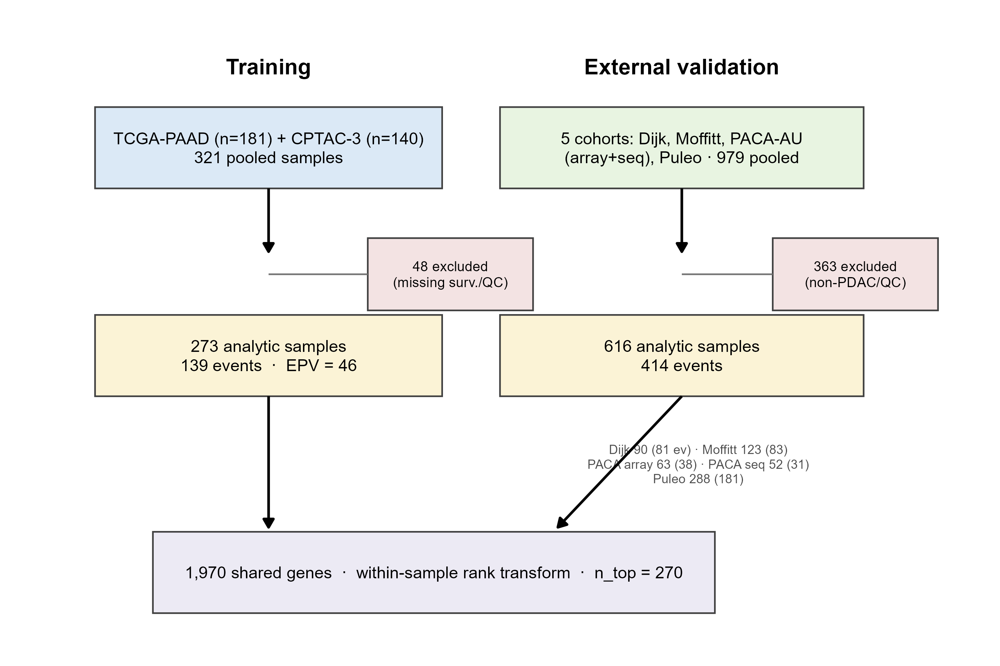{width="64%"}

::: {.notes}
Before the PDAC results, the data. Training pools TCGA-PAAD and CPTAC-3 (RNA-seq): 321 samples → 48 excluded for missing survival or QC → 273 analytic, 139 events. Validation is five fully independent cohorts — Dijk, Moffitt, PACA-AU array and RNA-seq, and Puleo — 979 pooled → 616 analytic PDAC, 414 events. Genes: per-cohort top-3,000 by mean- and variance-rank, intersected to 1,970 shared genes, then a within-sample rank transform that keeps everything nonnegative for NMF. n_top = 270 chosen by BO. Two things to take away: events per variable is 139/3 ≈ 46, far above the rule-of-thumb 10, so the training fit isn't overfit; and no validation survival ever enters the fit — external cohorts are scored purely by projection. That's what makes the generalization claims clean.
:::

## DeSurv concentrates survival signal into one factor

{width="55%"}

::: {.notes}
This is the slide-4 thesis made empirical in PDAC. x-axis: each factor's share of reconstruction (normalized Shapley value, partitions and sums to 100%); y-axis: its survival contribution (drop in partial log-likelihood when removed). DeSurv's D1 sits top-left — it carries essentially all the survival signal (Δℓ ≈ 66) at only a modest reconstruction share. The factors that reconstruct PDAC best — DeSurv's D3 and NMF's N1/N3 at the right — contribute almost nothing to survival. Reconstruction and prognosis are decoupled, so an unsupervised, reconstruction-driven choice walks right past the prognostic factor.
:::

## Supervision reorganizes PDAC factors around prognosis

:::: {.columns}

::: {.column width="50%"}

:::

::: {.column width="50%"}
::: {.fragment}

:::
:::

::::

::: {.notes}
Same data, same rank k=3, different factors. DeSurv's D1 fuses Classical tumor *and* restCAF stroma into one prognostic axis — a tumor–stroma coupling, not a pure tumor signal. Unsupervised NMF instead burns a whole factor (N2) on exocrine/ADEX — normal-pancreas contamination and purity — and splits the rest across N1/N3. Supervision rebuilds what each factor captures; D1 has no clean NMF counterpart.
:::

## D1 stays prognostic across five independent cohorts

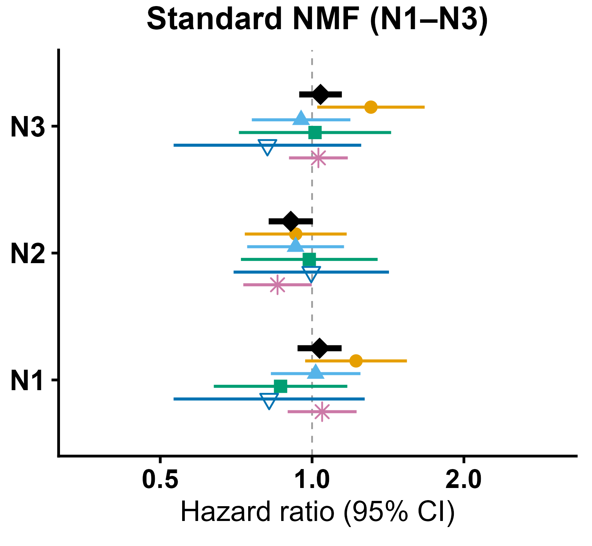{.absolute top="170" left="60" width="830"}

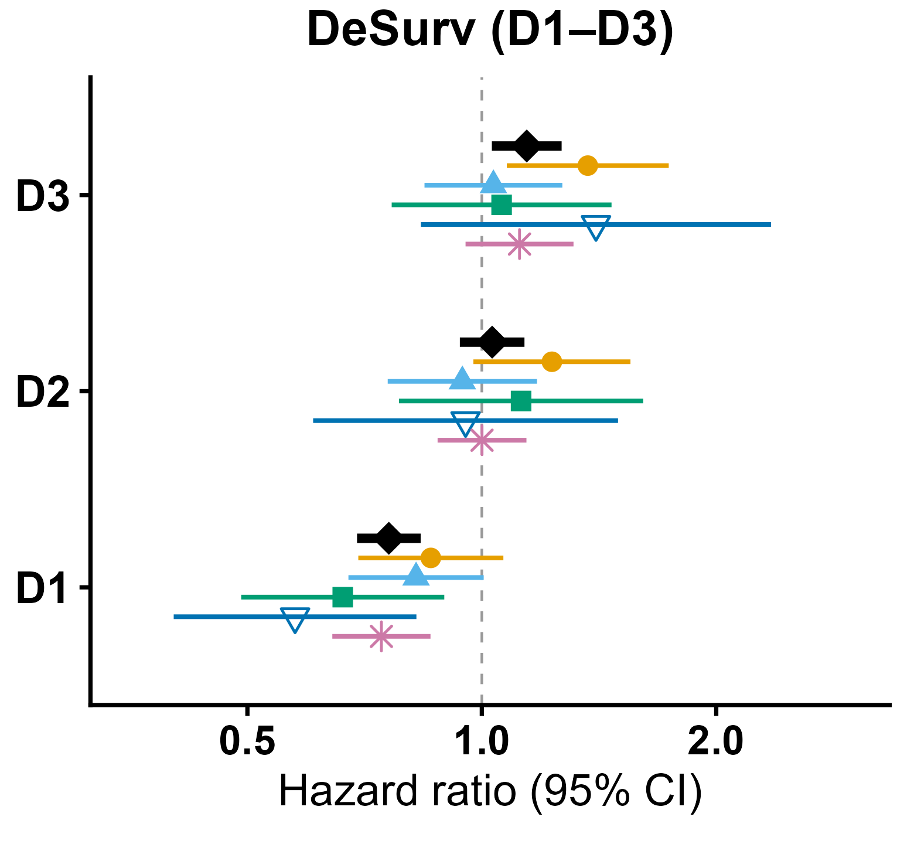{.fragment .absolute top="170" left="1030" width="830"}

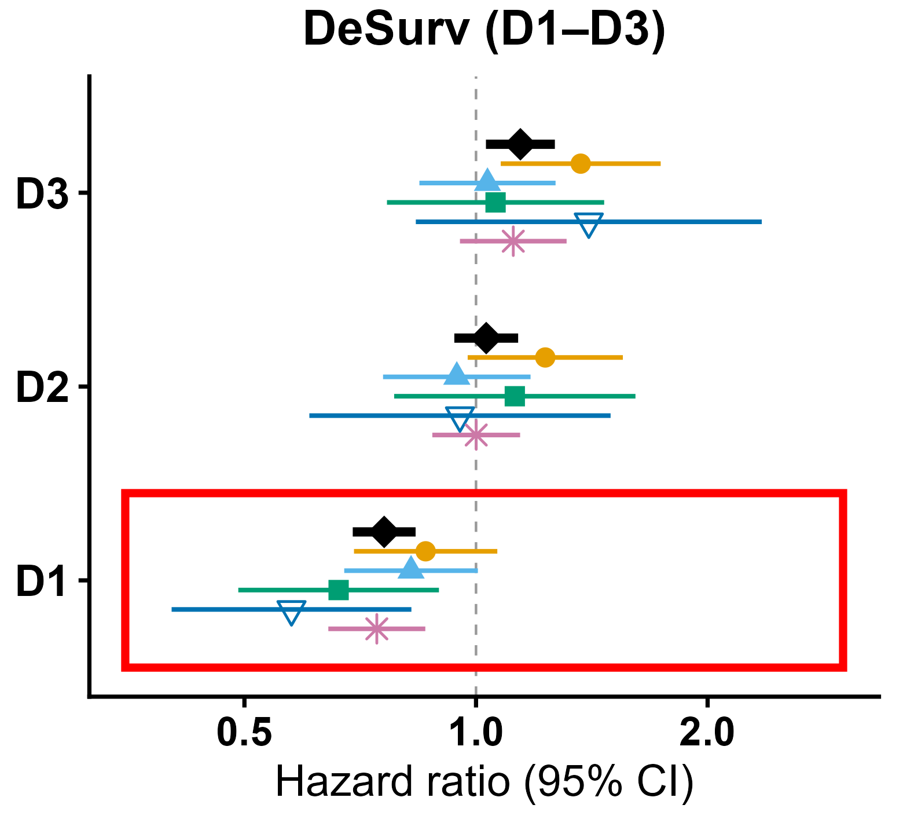{.fragment .absolute top="170" left="1030" width="830"}

{.absolute bottom="30" left="335" width="1250"}

::: {.notes}
The real test: does D1 transport? Five external cohorts (Dijk, Moffitt, both PACA-AU platforms, Puleo), scored purely by projection Z = W̃ᵀX_new — no retraining, no validation survival used in the fit. Standard NMF (left) has no factor with a clean, reproducible signal — the pooled estimates all straddle 1. DeSurv (click) is different: D1 (boxed) is protective and consistent — every cohort's CI sits at or below 1, pooled HR ≈ 0.76. Supervision didn't just reorganize the training factors; it produced a program that generalizes.
:::

## DeSurv stratifies clinical risk better than matched-rank NMF

:::: {.columns}

::: {.column width="50%"}
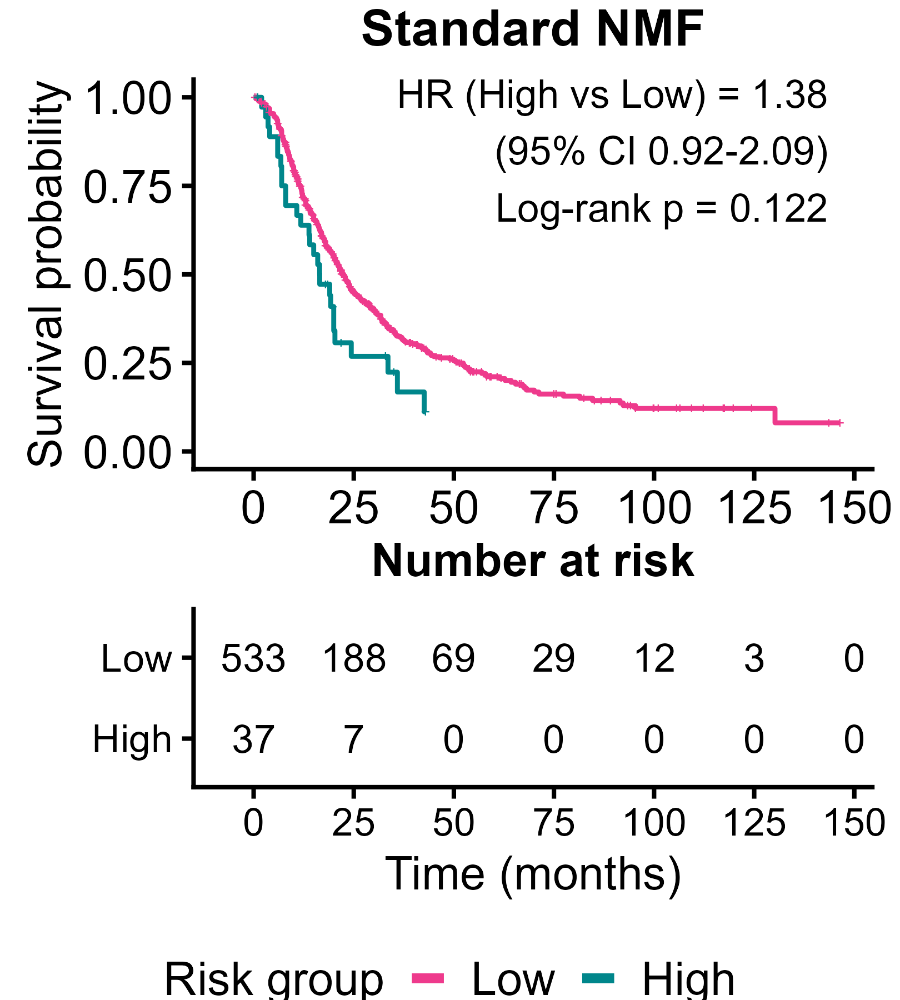
:::

::: {.column width="50%"}
::: {.fragment}
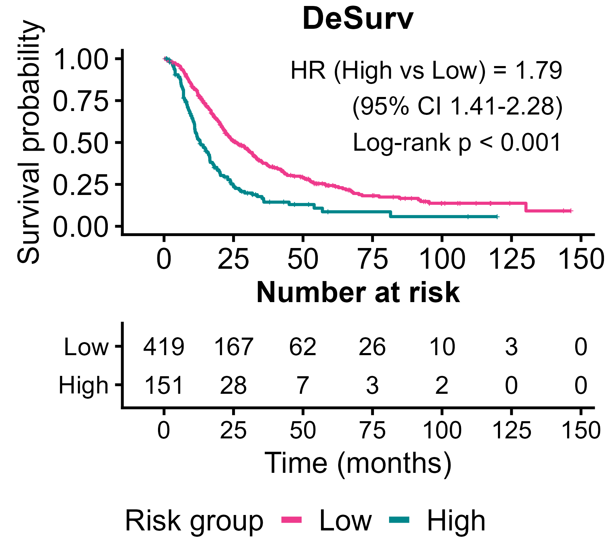
:::
:::

::::

::: {.notes}
Pooled validation KM at a cutpoint chosen by cross-validation on the training data. Matched-rank NMF (left) can't separate risk: HR 1.38, p = 0.122, and it dumps almost everyone into the low-risk group (533 vs 37). DeSurv (click) splits high- vs low-risk cleanly: HR 1.79, log-rank p < 0.001, with a balanced split. Same rank, same projection rule — supervision is what turns the factors into a usable risk score. This survives adjustment for PurIST and DeCAF (HR 1.33, 95% CI 1.13–1.56), so it's independent prognostic value, not a restatement of existing subtypes.
:::

## Prognosis in PDAC is tumor–stroma coupling, not tumor alone

::: {.highlight-box}
DeSurv's prognostic axis **D1 fuses Classical tumor with restraining-CAF stroma** into a single factor — a tumor–stroma *coupling*, recovered **de novo** with no pre-specified signatures.
:::

:::: {.columns}

::: {.column}
#### What D1 captures
- Classical (well-differentiated) tumor program
- restCAF stromal program **in the same factor**
- High D1 → favorable outcome (pooled HR ≈ 0.76)
:::

::: {.column}
#### Why it matters
- Prognosis is **not purely tumor-intrinsic**
- Consistent with DeCAF and single-cell CAF biology
- Unsupervised NMF splits this signal and misses the coupling
:::

::::

::: {.notes}
The biology DeSurv surfaces is the headline finding. The single most prognostic axis in PDAC is not a pure tumor state — it pairs the Classical tumor phenotype with a restraining CAF stromal program. We recovered this de novo, without feeding in Moffitt/PurIST/DeCAF signatures. It lines up with the emerging DeCAF and single-cell view that stromal composition co-determines outcome. Unsupervised NMF can't see it because it splits tumor and stroma across separate variance-driven factors.
:::

## DeSurv helps when prognosis hides in low-variance programs

:::: {.columns}

::: {.column}
#### Where the gain is largest
- Prognostic programs explaining **modest variance** — easily missed unsupervised
- Low-abundance stromal / CAF signals diluted in bulk tissue
:::

::: {.column}
#### Where it doesn't
- **Null signal (β = 0):** BO drives α → 0, DeSurv collapses to NMF
- No hallucinated structure; not a competing classifier
:::

::::

::: {.highlight-box-navy}
**The data decide.** Supervision bends the factorization toward prognosis *only* when prognostic signal is actually present — otherwise you recover ordinary NMF.
:::

::: {.notes}
Be honest about scope. DeSurv's advantage is largest exactly in the regime that motivated it: prognostic programs that explain little variance, so unsupervised methods walk past them. Under the null, where survival carries no signal, Bayesian optimization drives alpha to zero and you get standard NMF back — the method doesn't manufacture structure. So this is not a replacement for exploratory NMF and not a head-to-head classifier; it's a targeted tool for when prognosis and variance disagree.
:::

## Limitations point to neoadjuvant and single-cell extensions

:::: {.columns}

::: {.column}
#### Limitations
- Cox proportional-hazards assumption
- Demonstrated in **PDAC only**, treatment-naive cohorts
- Bayesian-optimization cost grows at scale
:::

::: {.column}
#### Future work
- Extend to **neoadjuvant / treated** cohorts
- Bridge to **single-cell-annotated** data to sharpen programs
- Apply the framework **beyond PDAC**
:::

::::

::: {.notes}
Limitations, stated plainly. The survival model is Cox proportional-hazards, so non-proportional effects aren't captured. Everything here is PDAC and treatment-naive cohorts. Bayesian optimization adds compute. The natural next steps follow directly: neoadjuvant and treated cohorts; pairing with single-cell-annotated data to resolve what D1's programs are at cell-type resolution; and testing the framework in other cancers where prognosis may again hide in low-variance programs.
:::

## Survival supervision yields transportable prognostic programs

::: {.highlight-box}
A **survival-supervised gradient on W**, with joint Bayesian-optimization tuning and 1-SE model selection, turns bulk transcriptomes into **prognostic programs that transport** to new cohorts by simple projection. Released as an open-source R package.
:::

#### Take-home
- **Reconstruction ≠ prognosis** — supervision recovers the prognostic basis that unsupervised NMF misses
- Validated two non-circular ways: **ground-truth recovery** in simulation and **out-of-sample generalization** across 5 cohorts
- The prognostic axis in PDAC is a **tumor–stroma coupling** (D1), found de novo

::: {.notes}
The one sentence to remember: supervising the gradient on W — the gene programs — while tuning k, alpha, and lambda jointly by cross-validated C-index, produces prognostic programs that carry over to new data by projection alone. Everything rests on the opening claim that reconstruction and prognosis are different objectives, and we backed it both in a controlled simulation and in true external validation. The package is open source so others can apply it.
:::

## Thank you {.center}

:::: {.columns}

::: {.column}
#### Advisor & committee
Naim Rashid (advisor) {{COMMITTEE MEMBERS}}

#### Collaborators
Jen Jen Yeh · Naim Rashid lab Yurovsky · Peng · Li
:::

::: {.column}
#### Data & funding
TCGA, CPTAC, and the 5 validation cohorts 
DOD HT9425241103100121
:::

::::

::: {.center .muted style="margin-top: 1em;"}
Questions welcome.
:::

::: {.notes}
Thank the committee, the Rashid lab, Jen Jen Yeh and the clinical collaborators, the consortia and cohorts whose data made external validation possible, and DOD funding. Open for questions.
:::

## Backup slides {background-color="#13294B" .center}

<!-- Not presented linearly — each backs a specific anticipated question. -->

## Backup · The full DeSurv objective

$$\mathcal{L}(W,H,\beta) = (1-\alpha)\underbrace{\Big[\tfrac{1}{2np}\lVert X-WH\rVert_F^2 + \tfrac{\lambda_H}{2nk}\lVert H\rVert_F^2\Big]}_{\text{reconstruction}} \;-\; \alpha\underbrace{\Big[\tfrac{2}{n_e}\,\ell(W,\beta) - \lambda\big(\xi\lVert\beta\rVert_1 + \tfrac{1-\xi}{2}\lVert\beta\rVert_2^2\big)\Big]}_{\text{Cox survival}}$$

- Cox model runs on factor scores $Z = W^\top X$; $\ell$ is the Cox log-partial likelihood
- $\alpha \in [0,1)$ balances the two losses — **$\alpha = 0$ recovers standard NMF**
- $\lambda_H,\lambda \ge 0$ regularize $H$ and $\beta$; $\xi \in [0,1]$ sets the elastic-net mix

## Backup · Block-coordinate descent updates

Cycle three blocks to a stationary point (SI Algorithm S1):

- **H** — multiplicative, convex QP, nonincreasing:
$$H \leftarrow \max\!\Big(H \odot \frac{W^\top X}{W^\top W H + \lambda_H H + \varepsilon},\ \varepsilon\Big)$$
- **W** — hybrid multiplicative with gradient-balancing factor $\zeta$ (clipped), **backtracking line search**, then column normalization (preserves $WH$ and $W\beta$)
- **β** — elastic-net Coxnet, cyclic coordinate descent (closed-form soft-thresholding)

## Backup · Convergence to a stationary point

:::: {.columns}

::: {.column width="58%"}
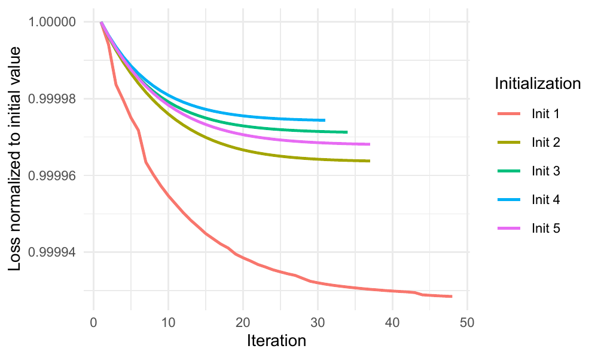{width="820"}
:::

::: {.column width="42%"}
- Objective is **monotone nonincreasing** → finite limit; every limit point is a **stationary (KKT) point** (SI Thm 1)
- 5 multistart trajectories converge within ~5,000 iterations
- **Caveat:** the Coxnet β-step uses an approximate Hessian, so the proof is for an idealized update — empirically stable
:::

::::

## Backup · Why supervision enters W, not H

:::: {.columns}

::: {.column width="52%"}
{width="780"}
:::

::: {.column width="48%"}
- NMF is non-identifiable: $(W,H)\to(WR,R^{-1}H)$ preserves reconstruction
- Supervising **H** could lower Cox loss by reshuffling patient loadings while leaving programs $W$ ~unchanged
- Supervising **W** makes programs gene-level → new samples embed by projection $Z_{\text{new}} = X_{\text{new}}^\top \tilde W$ (no per-sample refit)
:::

::::

## Backup · Hyperparameters via Bayesian optimization

:::: {.columns}

::: {.column width="58%"}
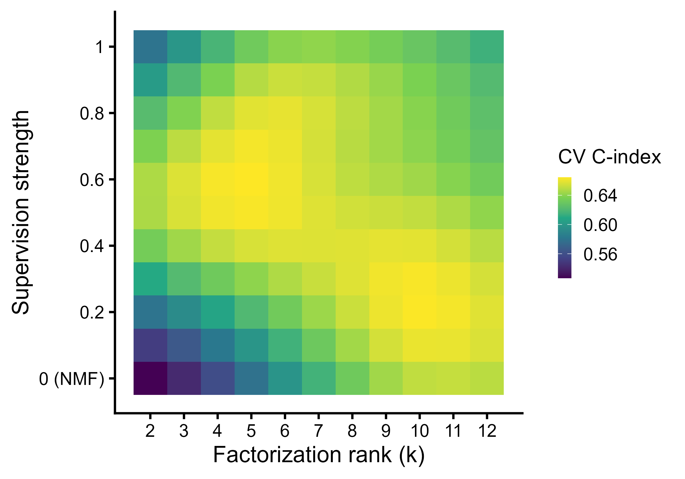{width="840"}
:::

::: {.column width="42%"}
- GP surrogate (Matérn + ARD), Expected-Improvement acquisition over $k,\alpha,\lambda,\xi,n_{\text{top}}$
- Objective = **nested-CV mean C-index** (Algorithm S2); no validation survival used
- Final $k$ by the **1-SE rule** → $k=3$; C-index plateau spans $k=3$–$12$
:::

::::

## Backup · Null and mixed simulation scenarios

:::: {.columns}

::: {.column width="44%"}
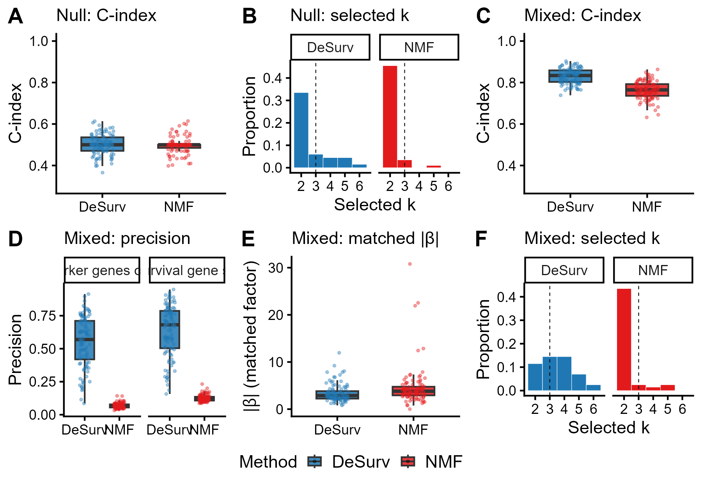{width="640"}
:::

::: {.column width="56%"}
- **Null ($\beta=0$):** both methods C-index ≈ 0.5; BO drives $\alpha\to0$ — DeSurv does **not** hallucinate structure
- **Mixed (survival on markers + background):** marker-only precision strongly favors DeSurv; matched factor gets larger $|\beta|$
- Dose–response: advantage greatest (primary) → moderate (mixed) → absent (null)
:::

::::

## Backup · NMF rank-selection heuristics disagree

:::: {.columns}

::: {.column width="60%"}
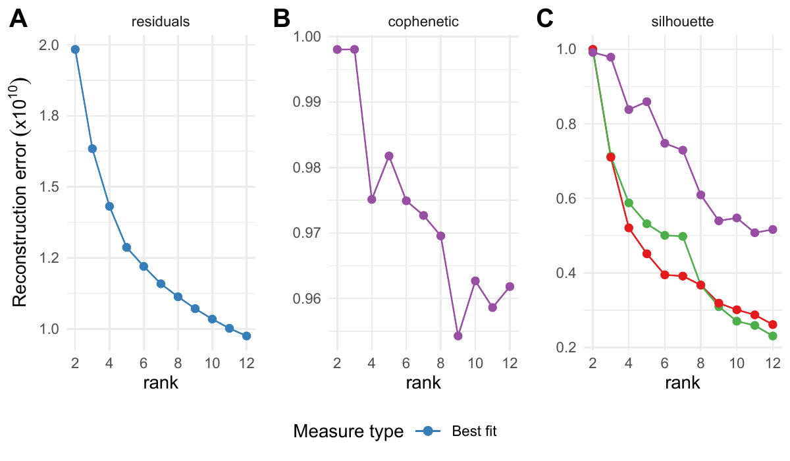{width="850"}
:::

::: {.column width="40%"}
- Reconstruction residuals decrease smoothly — **no elbow**
- Cophenetic correlation fluctuates — **no clear transition**
- Silhouette favors very low $k$
- The three criteria **disagree** on the same data → motivates survival-supervised selection
:::

::::

## Backup · C-index across factorization rank

:::: {.columns}

::: {.column width="50%"}
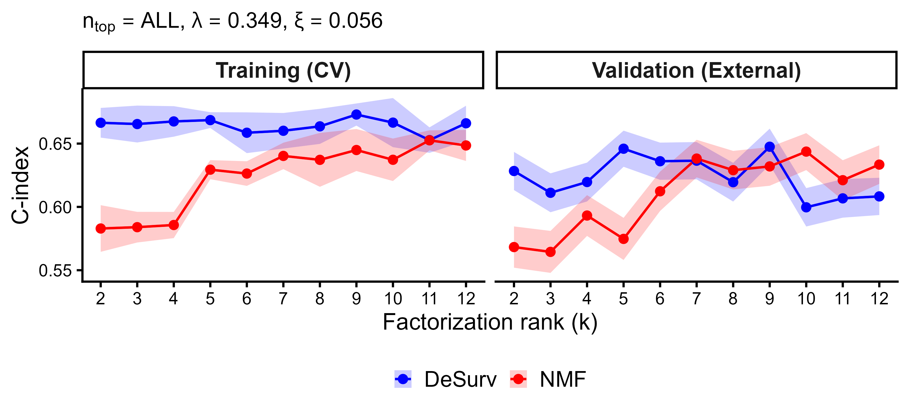{width="720"}
:::

::: {.column width="50%"}
- Selected operating point: $n_{\text{top}}=270$, $\alpha=0.349$, $\lambda=0.056$
- DeSurv > NMF at **every** $k$ in training
- DeSurv $k=3$ ≈ NMF $k=7$ in external validation → supervision concentrates prognostic info into fewer factors
:::

::::

## Backup · NMF at its own ranks (k = 5, 7)

:::: {.columns}

::: {.column width="52%"}
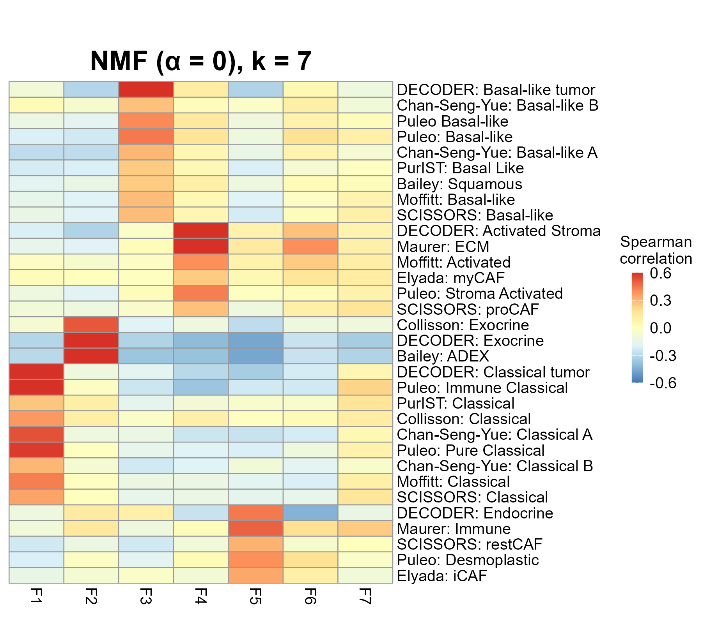{width="780"}
:::

::: {.column width="48%"}
- Elbow → $k=5$; BO with $\alpha=0$ → $k=7$
- $k=5$: re-derives the $k=3$ core + Exocrine-like and restCAF **variance** factors (no new prognostic content)
- $k=7$: more fragmentation, no new coherent program — matches DeSurv C-index but needs **>2× factors**
:::

::::

## Backup · Risk cutpoint selection & per-cohort KM

:::: {.columns}

::: {.column width="42%"}
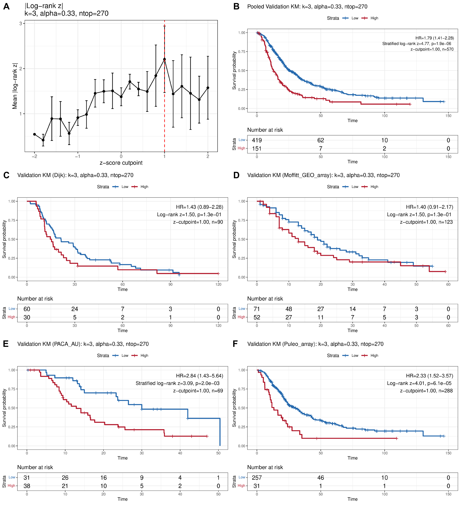{width="660"}
:::

::: {.column width="58%"}
- Cutpoint chosen by CV on TCGA+CPTAC: grid $z\in\{-2,\dots,2\}$, maximize mean $|\text{log-rank }z|$
- Applied to validation by standardizing with **training** mean/SD
- Consistent high-risk separation across Dijk, Moffitt, PACA-AU (array+seq), Puleo
:::

::::

## Backup · Risk-group subtype composition

:::: {.columns}

::: {.column width="40%"}
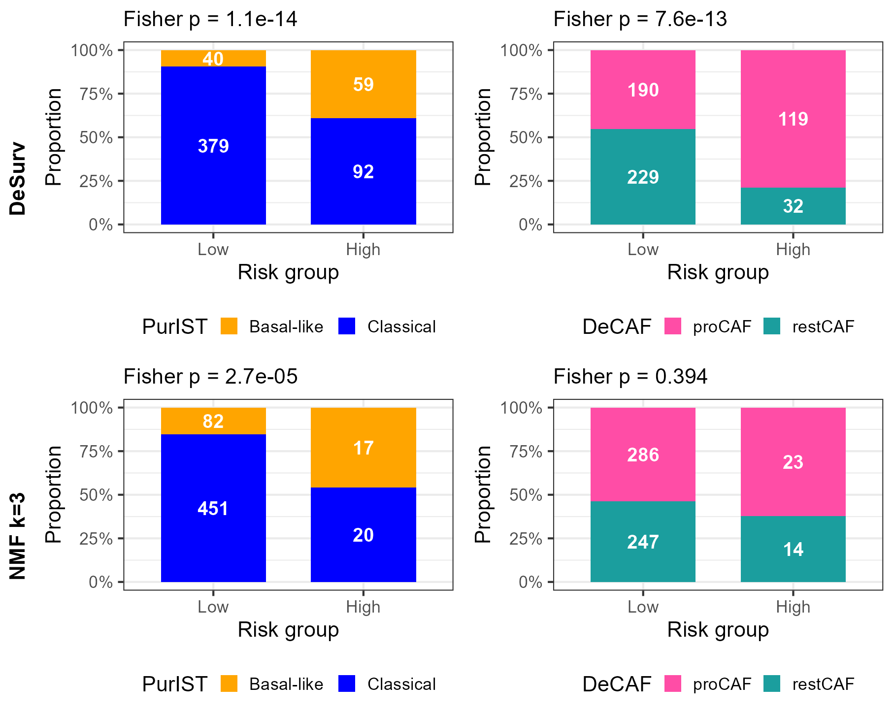{width="620"}
:::

::: {.column width="60%"}
- DeSurv high-risk group enriched for **both** Basal-like (PurIST) **and** proCAF (DeCAF)
- NMF $k=3$ group: Basal-like enrichment but **no** significant proCAF — misses the tumor–stroma coupling
- Adjusted for PurIST + DeCAF, DeSurv LP retains **HR = 1.33** (95% CI 1.13–1.56, $P<0.001$)
:::

::::

## Backup · Variance and survival contribution metrics

- **Reconstruction Shapley share** — per-factor contribution to the model's reconstruction; partitions and sums to 100% (main-text Fig 3C x-axis)
- **Conditional variance** (semi-partial $R^2$): $\;V_j = (\mathrm{RSS}_{-j} - \mathrm{RSS}_{\text{full}})/\lVert X\rVert_F^2$
- **Survival contribution** (Type III): $\;\Delta\ell_j = \ell(\text{full}) - \ell(\text{drop factor } j)$ at the MPLE
- **Factor specificity** of top genes: $\;s_{ij} = W^*_{ij} - \max_{j'\neq j} W^*_{ij'}$, with $W^*$ column-max scaled

## Backup · Factor gene lists (top of each program)

270 genes per factor (BO-selected $n_{\text{top}}$); top entries by contrast score:

:::: {.columns}

::: {.column}
#### D1 · Classical + restCAF
DMBT1, IGFBP2, S100A4, KRT23, LIF, IFI6, PDLIM3, CLDN18 …
:::

::: {.column}
#### D2 · proCAF
UHMK1, DDR2, INHBA, DYNC2H1, ZDHHC20, ITPR2, HMCN1, LAMA2 …
:::

::::

#### D3 · Basal-like + proliferation
HSPB1, KRT7, MSLN, RPSAP58, S100P, RPS16, IL32, SH3BGRL3 …
